# Auxion — System Architecture

The definitive technical handbook for how Auxion works. Everything here is
derived from the current implementation; it documents what exists, not what is
planned. For per-sprint history see `ENGINEERING_CONTEXT.md` — this document is
the standing reference.

> Public brand: **Auxion**. Internal package scope and CSS variables remain
> `@brightloop/*` / `--bl-*` by deliberate decision; they are not a rename bug.

---

## Table of contents

1. [Product overview](#1-product-overview)
2. [Core design principles](#2-core-design-principles)
3. [Repository structure](#3-repository-structure)
4. [Package responsibilities](#4-package-responsibilities)
5. [Phase A architecture](#5-phase-a-architecture)
6. [Phase B runtime architecture](#6-phase-b-runtime-architecture)
7. [Phase C application bridge](#7-phase-c-application-bridge)
8. [AI reasoning pipeline](#8-ai-reasoning-pipeline)
9. [Runtime lifecycle](#9-runtime-lifecycle)
10. [Queue architecture](#10-queue-architecture)
11. [Persistence model](#11-persistence-model)
12. [Repository layer](#12-repository-layer)
13. [Provider abstraction](#13-provider-abstraction)
14. [API layer](#14-api-layer)
15. [Security model](#15-security-model)
16. [Authorization model](#16-authorization-model)
17. [RLS model](#17-rls-model)
18. [Event model](#18-event-model)
19. [Artifact model](#19-artifact-model)
20. [Testing strategy](#20-testing-strategy)
21. [Deployment architecture](#21-deployment-architecture)
22. [Environment variables](#22-environment-variables)
23. [Failure recovery](#23-failure-recovery)
24. [Runtime invariants](#24-runtime-invariants)
25. [Architectural decision records](#25-architectural-decision-records)
26. [Glossary](#26-glossary)

---

## 1. Product overview

Auxion is a **Business Transformation Operating System** built around an
asynchronous **Business Intelligence Engine**: it scans a business, assembles an
evidence-grounded intelligence graph, reasons over it through AI providers, and
produces findings, recommendations, competitor snapshots, proposals, and
audience-scoped narratives.

Two tracks run in one monorepo:

- **Track A — the transformation-cycle product**: Signals → Insights →
  Recommendations → Approvals → Moves → Execution → Measurement → Learning,
  surfaced through an authenticated admin/portal web app.
- **Track B — the Business Intelligence Engine**: the async scan/reasoning
  backend. Built as **Phase A** (deterministic engine), **Phase B** (durable
  runtime), and **Phase C** (productization — the application boundary and live
  provider adapters).

This document focuses on Track B and the shared platform, because that is where
the majority of the current architecture lives.

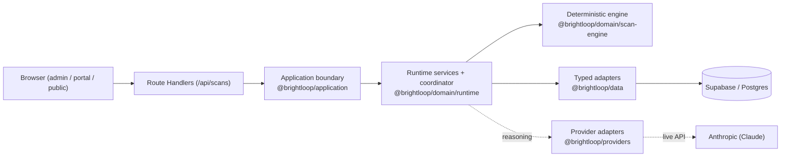

---

## 2. Core design principles

These are enforced across the codebase, not aspirational.

- **Deterministic core, durable edge.** Phase A is pure logic with no I/O — every
  function takes a supplied `now` and is unit-testable without a clock, network,
  or database. Phase B makes runs durable without changing those decisions.
- **The domain package is Node-free.** `@brightloop/domain` has no `@types/node`,
  no `node:*` imports, no `URL` global. Checksums use a pure FNV-1a
  (`hashContent`) over canonical JSON; URL parsing uses pure regex. This keeps
  the engine portable and side-effect-free.
- **One decision, one owner.** A rule (stage dependency, legal transition, retry
  disposition, checksum) is defined once in Phase A and **consulted, never
  restated** by Phase B or Phase C. Re-deriving a rule elsewhere would fork the
  truth.
- **Contracts before code.** Every entity is a Zod schema in `@brightloop/schema`
  first; domain logic and typed adapters consume the inferred types.
- **Three-layer integrity.** Every privileged operation passes capability
  (service) → lifecycle guard (service/DB trigger) → RLS (database). No single
  layer is trusted alone.
- **Structural guarantees over conventions.** Immutability, append-only logs, and
  no-raw-model-output are enforced by the absence of methods, revoked grants, and
  missing columns — not by discipline.
- **Vendor-agnostic engine.** The domain names no AI vendor; providers are opaque
  ids behind an interface, implemented only at the infrastructure edge.
- **Nothing enables live AI or spends money by default.** Live providers and
  live tests are off unless explicitly switched on.

---

## 3. Repository structure

Monorepo: **pnpm 9.15 workspaces + Turborepo**, workspace root `application/`.

```
BrightLoop-Platform/
├─ .github/workflows/ci.yml         # CI: verify · db-verify · gitleaks
├─ docs/
│  ├─ architecture/SYSTEM_ARCHITECTURE.md   # this document
│  ├─ engineering/                  # runtime-sequences, live-provider-adapter
│  ├─ intelligence/                 # AIS-001..006 canonical specs
│  └─ design/source/                # PDF surface + engine specs
├─ ENGINEERING_CONTEXT.md           # per-sprint standing context
└─ application/
   ├─ pnpm-workspace.yaml
   ├─ turbo.json                    # build/lint/typecheck/test pipeline
   ├─ tsconfig.base.json            # strict TS: noUncheckedIndexedAccess, verbatimModuleSyntax
   ├─ eslint.config.mjs
   ├─ apps/web/                     # Next.js 15 app (admin/portal/public surfaces + /api)
   ├─ packages/
   │  ├─ schema/                    # Zod contracts (source of truth for shapes)
   │  ├─ db/                        # generated Supabase types (never hand-edited)
   │  ├─ ui/                        # design system + motion
   │  ├─ domain/                    # Node-free: engine + runtime services (pure)
   │  ├─ data/                      # typed Supabase adapters (persistence)
   │  ├─ application/               # the API boundary (use-cases, DTOs, errors)
   │  └─ providers/                 # infra: live AI provider adapters (SDK-owning)
   └─ supabase/
      ├─ migrations/                # additive SQL migrations
      └─ tests/                     # pgTAP suites
```

Build conventions:

- `schema`, `db`, `domain`, `data`, `application`, `providers` build to `dist` and
  are consumed as compiled output; relative imports use `.js` extensions.
- `ui` is consumed as source (extensionless imports).
- Strict TypeScript everywhere: `strict`, `noUncheckedIndexedAccess`,
  `noUnusedLocals/Parameters`, `verbatimModuleSyntax`, `isolatedModules`.

---

## 4. Package responsibilities

### Dependency graph

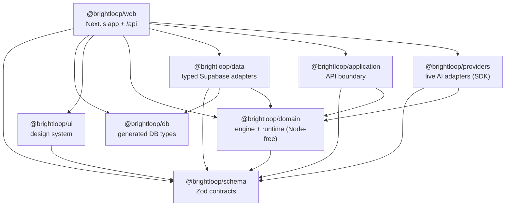

Edges are the actual `workspace:*` dependencies in each `package.json`.

| Package | Responsibility | Notable constraint |
|---|---|---|
| `@brightloop/schema` | Every entity/enum as a Zod schema + inferred type. The single source of truth for shapes. | Depends on nothing but `zod`. |
| `@brightloop/db` | Supabase-generated `Database` types. | **Never hand-edited** — regenerated by CI; drift fails the build. |
| `@brightloop/ui` | Design-system components, tokens, motion presets. | Consumed as source by the web app. |
| `@brightloop/domain` | The deterministic engine (`scan-engine/*`) and the runtime services (`runtime/*`). Pure logic. | **Node-free** — no `@types/node`, no SDK, no clock. |
| `@brightloop/data` | Typed Supabase adapters implementing the domain repository ports; row↔domain mappers. | Row types derived from generated `Database`; no `any`, no hand-authored DB types. |
| `@brightloop/application` | The application boundary: nine scan use-cases, DTOs, canonical errors, authorization, validation. | Depends only on `domain` + `schema`; knows no HTTP/React/Supabase-Auth. |
| `@brightloop/providers` | Live AI provider adapters (Anthropic). | The ONLY package importing a vendor AI SDK; server-only. |
| `@brightloop/web` | Next.js 15 app: admin/portal/public surfaces, `/api` route handlers, the composition root. | The only place a concrete data source or provider is named. |

---

## 5. Phase A architecture

Phase A is the deterministic Business Intelligence Engine — **contracts + pure
logic** across twelve sprints. It performs no real I/O: no live model call, no
production provider SDK, no crawler runtime, no persistence. The pipeline runs on
a deterministic in-memory provider adapter and discovery/evidence fixtures.

Canonical specs: **PDF 26** (surfaces), **PDF 27** (the engine: 8 layers /
13-stage pipeline / 6 reasoning stages / 4 evidence states / 6-factor
confidence), and **AIS-001..006** (orchestrator, multi-agent, recommendation
mathematics, proposal intelligence, competitor intelligence, continuous
monitoring).

Each sprint = a `@brightloop/schema` contract module + a pure
`@brightloop/domain/scan-engine/*` logic module + deterministic tests.

```mermaid
flowchart TB
  subgraph engine["scan-engine (pure)"]
    routing["routing/ · provider registry, cost-aware route()"]
    evidence["evidence/ · 6-factor confidence, hashing"]
    graph["graph/ · intelligence graph + snapshot"]
    discovery["discovery/ crawler/ · plan, robots, SSRF (regex)"]
    reasoning["reasoning/ · job model, grounding guards, retry"]
    execution["execution/ · provider adapter seam, validation, accounting"]
    pipeline["pipeline-run/ · 13-stage run, artifacts, checkpoints"]
    decision["decision-science/ · EV, priority π, portfolio"]
    competitor["competitor-intelligence/ · similarity, benchmarks"]
    proposal["proposal-intelligence/ · evidence-backed proposals"]
    narrative["narrative/ · audience-scoped, redaction"]
  end
```

Guarantees baked into Phase A that later phases rely on:

- **Grounding**: no claim without evidence; fabricated metrics, competitors, and
  benchmarks are rejected, not published (AIS-005's two inviolable rules).
- **Confidence**: geometric-mean 6-factor model — any near-zero factor caps it.
- **Checksums**: FNV-1a over canonical JSON (`hashContent`) — the same function
  used durably in Phase B, so an in-memory artifact and its persisted counterpart
  hash identically.
- **No hidden chain-of-thought** anywhere in contracts or outputs.

---

## 6. Phase B runtime architecture

Phase B turns the pure engine into a **durable runtime**: runs can be persisted,
resumed after a crash, and coordinated through services and a Postgres-backed job
queue — while every Phase-A decision stays authoritative. It landed in three
slices: **13A** (schema/migration/RLS/pgTAP/types), **13B** (repository ports +
typed adapters + atomic leasing), **13C** (services, execution engine,
coordinator, read models).

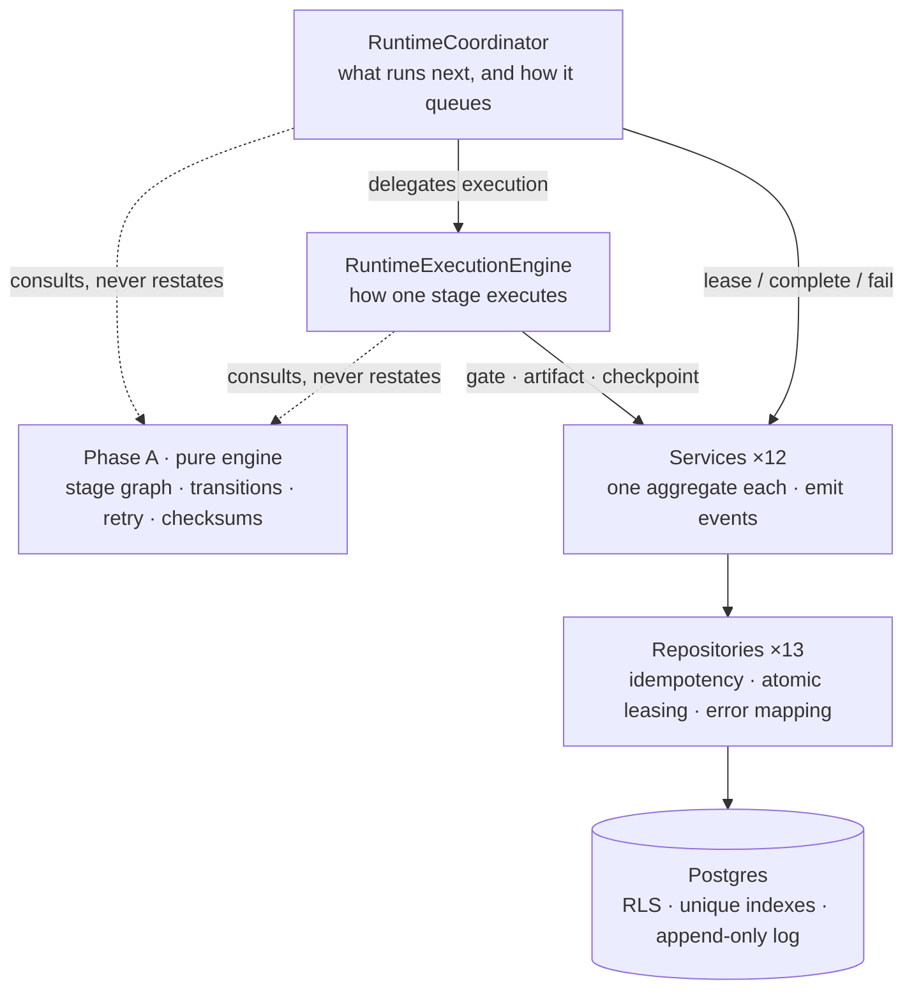

Two load-bearing rules:

1. **The execution engine never touches the queue.** Stage execution is testable
   and reusable without a queue in the picture.
2. **Deduplication is structural.** Every idempotency key is a pure function of
   natural identity (`run:{scanId}`, `art:{runId}:{kind}:{version}`,
   `q:{jobType}:{runId}:{stage}`), so a crash-and-retry recomputes the same key
   and the repository replays instead of duplicating. No dedupe table, no lock.

The **12 runtime services**: `RunService`, `PipelineService`, `QueueService`,
`ReasoningService`, `ArtifactService`, `CheckpointService`, `EventService`,
`FindingService`, `RecommendationService`, `CompetitorService`,
`ProposalService`, `NarrativeService`, `ProviderAttemptService`. Each depends only
on the narrow repository interface it needs; the composite `RuntimeRepository`
appears only at the composition root.

---

## 7. Phase C application bridge

Phase C exposes the runtime to the product, one thin layer at a time.

**C1 — Product API Bridge.** The `@brightloop/application` package and eight
`/api/scans` route handlers. Nine use-cases (create/cancel/retry/get/list/
timeline/report/proposal/narrative), one file each, no god-service. The full
call path:

```
Browser → Route Handler → @brightloop/application use-case
        → RuntimeCoordinator → RuntimeExecutionEngine → Repositories → DB
```

- The **browser never receives a domain entity** — `toScanDTO` is the only bridge.
- **No SQL or stack trace escapes** — only the stable `RuntimeErr.code` is read;
  only `ApplicationError#toBody` is serialized; unexpected throws become a 500.
- **Authorize on the loaded row** — read-then-authorize against `run.clientId`, so
  a caller can't assert ownership of an id it doesn't own.

**C2 — Live Claude Provider Adapter.** The `@brightloop/providers` package: the
first production `ReasoningProviderAdapter`, implementing the Sprint-7 seam
against the Anthropic SDK. Transport + normalization only, opaque provider id,
disabled by default. See [§13](#13-provider-abstraction).

---

## 8. AI reasoning pipeline

The engine's 13-stage pipeline (PDF 27 §03/§04). Each stage declares the artifact
kinds it **requires** and the one it **produces**; `stageDependenciesMet` is the
hard gate consulted before every stage.


Within `provider_execution`, the reasoning orchestrator runs a routed job through
provider adapters with retry + ordered fallback:

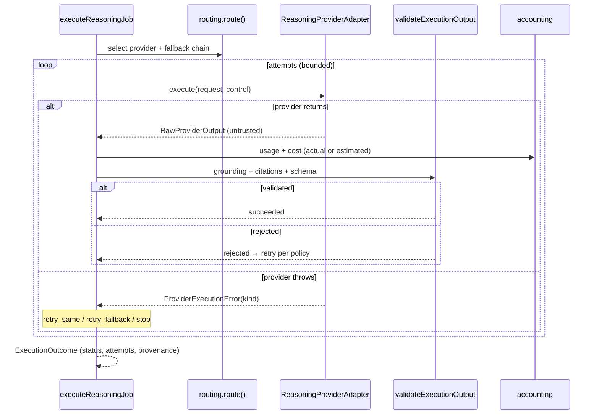

The retry disposition is Phase A's `decideRetry`: fatal/budget/cancelled → stop;
validation → retry same route; retryable/timeout → fall back when a chain exists.
Provider output is **untrusted until validated** — the adapter never bypasses
grounding, citation, confidence-ceiling, or fabricated-claim checks.

---

## 9. Runtime lifecycle

A run's durable lifecycle, driven one worker turn at a time (no daemon, no cron —
a caller decides when a turn happens).

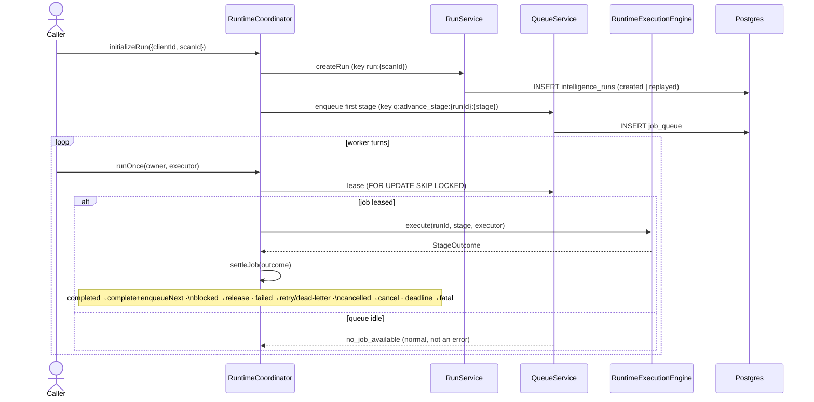

One stage's execution (the `RuntimeExecutionEngine`), six ordered steps:

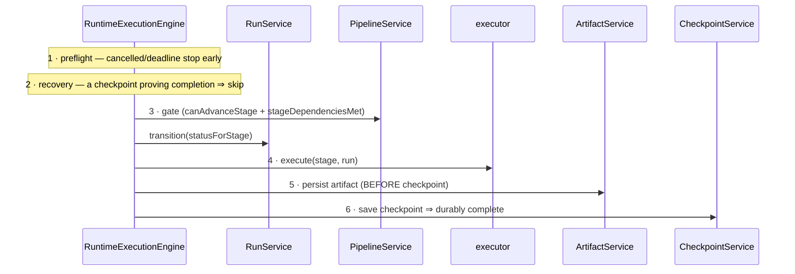

Step 5 precedes step 6 deliberately: a checkpoint must never reference an
artifact that does not exist.

Run statuses progress through `pending → discovering → … → preparing_report →
completed`, with `failed` / `cancelled` / `blocked` as exceptional states.
Terminal statuses accept no transition.

---

## 10. Queue architecture

Postgres **is** the queue — no Redis, no BullMQ, no Temporal, no hosted provider.

The core guarantee is a single-statement atomic lease via the
`bl_lease_next_job` RPC (`SECURITY INVOKER`, so `job_queue` RLS still applies):

```sql
UPDATE public.job_queue q
   SET status='leased', lease_owner=p_owner,
       lease_expires_at = now() + make_interval(secs => greatest(p_lease_seconds,1)),
       attempt = q.attempt + 1
 WHERE q.id = (SELECT c.id FROM public.job_queue c
    WHERE c.status='queued' AND c.available_at <= now()
      AND (p_job_type is null OR c.job_type = p_job_type)
      AND (p_client_id is null OR c.client_id = p_client_id)
    ORDER BY c.priority ASC, c.available_at ASC, c.created_at ASC
    LIMIT 1 FOR UPDATE SKIP LOCKED)
RETURNING q.*;
```

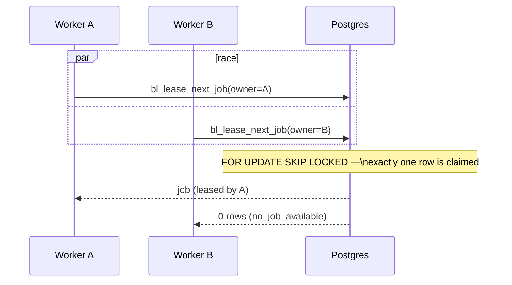

Queue mechanics:

- **Lease ownership** is re-asserted inside every mutating statement
  (`renew`/`release`/`complete`/`fail`/`reschedule`) — a non-owner loses even
  under a race, returning `lease_lost`.
- **Lease expiry needs no sweeper** — an expired lease simply stops matching the
  owner-scoped update and the row becomes eligible again.
- **Retry vs. dead-letter**: a failed job is rescheduled at a deterministic
  exponential backoff (`1s, 2s, 4s … capped at 300s`, no jitter) until attempts
  are exhausted, then dead-lettered. A `fatal` failure dead-letters immediately.
- **`requeueJob`** (Phase C1) resets a non-progressing job (`failed`/`dead_letter`/
  `cancelled`) back to `queued` so a stuck stage can be re-driven from the last
  valid checkpoint.
- **Blocked ≠ failed**: a blocked stage releases its lease **without consuming an
  attempt** — unmet dependencies are not a failed try.

Queue statuses: `queued`, `leased`, `completed`, `failed`, `cancelled`,
`dead_letter`. Lease statuses: `unleased`, `leased`, `expired`, `released`.

---

## 11. Persistence model

All persistence is **additive** Postgres migrations under `supabase/migrations/`,
applied clean in CI. Conventions: `text` primary keys, `client_id text references
public.clients(id) on delete cascade`, `public.<enum>` types, explicit grants to
`authenticated` + `service_role`.

The Phase-B runtime adds **13 tables** (migration `20260720000100`):

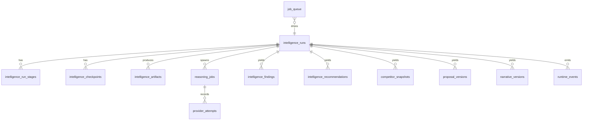

| Table | Role |
|---|---|
| `intelligence_runs` | The durable run lifecycle (14 statuses). |
| `intelligence_run_stages` | **One terminal row per (run, stage, attempt)** carrying the outcome. |
| `intelligence_checkpoints` | Resume points; superseding marks `invalidated`, never deletes. |
| `intelligence_artifacts` | Immutable, versioned, checksummed, lineage-bearing envelopes. |
| `reasoning_jobs` | The reasoning-job lifecycle. |
| `provider_attempts` | Per-attempt provider ledger (usage, cost, latency, `raw_response_ref`). |
| `intelligence_findings` / `_recommendations` | Derived records (envelope + checksum). |
| `competitor_snapshots` | Competitor-set snapshots. |
| `proposal_versions` / `narrative_versions` | Versioned artifacts with `supersedes_id` lineage. |
| `runtime_events` | Append-only event log, monotonic per aggregate. |
| `job_queue` | The Postgres job queue. |

Ten `runtime_*` Postgres enums mirror the `@brightloop/schema` runtime enums 1:1,
so typed adapters map rows without a cast. Generated types (`@brightloop/db`) are
regenerated by CI and **drift is a build failure** — they are never hand-edited.

Earlier migrations add the transformation product tables (12 tables + state
machine + approval gate), reputation/catalog, and Phase-1 core surfaces.

---

## 12. Repository layer

The runtime persistence boundary is **thirteen aggregate-scoped interfaces**
(`IntelligenceRunRepository`, `StageRepository`, `CheckpointRepository`,
`ArtifactRepository`, `ReasoningJobRepository`, `ProviderAttemptRepository`,
`FindingRepository`, `RecommendationRepository`, `CompetitorSnapshotRepository`,
`ProposalVersionRepository`, `NarrativeVersionRepository`,
`RuntimeEventRepository`, `JobQueueRepository`) composed into a `RuntimeRepository`
facade. A service depends on the narrowest slice it needs.

The concrete `SupabaseRuntimeRepository` (`@brightloop/data`) is fully typed
against the generated `Database` — no `any`, no cast, no hand-authored DB types.
Row types are **derived** from `Database["public"]["Tables"]`; `jsonb` is
validated into an object rather than trusted.

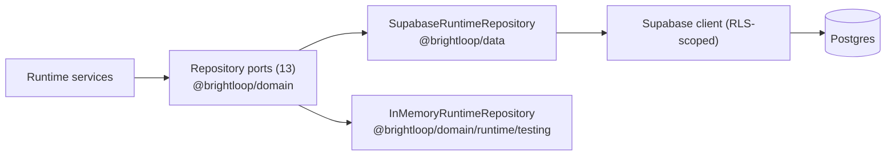

Every repository method returns a discriminated **`RuntimeResult`** — no raw
Postgres error crosses the boundary. Successes: `created`, `replayed`, `found`,
`updated`, `leased`, `released`. Failures: `conflict`, `not_found`,
`no_job_available`, `lease_lost`, `terminal_state`, `permission_denied`,
`unique_violation`, `foreign_key_violation`, `check_violation`,
`serialization_conflict`, `database_error`. `mapDatabaseError` translates SQLSTATEs
(23505/23503/23514/23502/42501/40001/40P01/PGRST116) plus RLS message sniffing.

The **idempotency contract** is uniform: same key + same canonical payload →
`replayed`; same key + different payload → `conflict` (never a silent overwrite).
`ArtifactRepository` and `RuntimeEventRepository` deliberately expose **no update
or delete method** — immutability is structural.

The `InMemoryRuntimeRepository` mirrors the adapter's semantics exactly
(idempotency, lease ownership + expiry, terminal states, sequence conflicts) so
deterministic tests are not more permissive than production.

---

## 13. Provider abstraction

The engine reasons through an opaque adapter seam (`ReasoningProviderAdapter`,
Sprint 7). The domain names no vendor.

```ts
interface ReasoningProviderAdapter {
  readonly providerId: string;                 // opaque, e.g. "anthropic-primary"
  capabilities(): ProviderCapability[];
  supportsStructuredOutput(): boolean;
  healthCheck(): Promise<ProviderHealthReport>;
  estimateTokens(request: ExecutionRequest): TokenEstimate;
  execute(request: ExecutionRequest, control: ExecutionControl): Promise<RawProviderOutput>;
}
```

The first production implementation is `AnthropicReasoningProviderAdapter`
(`@brightloop/providers`, Phase C2). It is **transport + normalization only**.

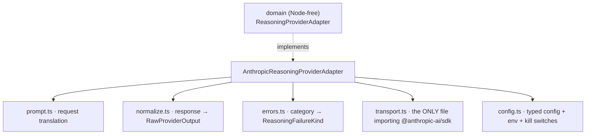

Key properties:

- **SDK containment**: only `transport.ts` imports the Anthropic SDK; no SDK type
  crosses the `AnthropicTransport` interface.
- **Prompt discipline**: JSON-only, exact output-contract id, explicit citations
  and limitations; bans fabricated metrics/competitors/benchmarks and
  unavailable-source claims; requests **no chain-of-thought/scratchpad**. Business
  content is wrapped in labelled data fences (prompt-injection defence).
- **Untrusted output**: the adapter parses JSON and returns it; the Sprint-7
  orchestrator does all grounding/citation/schema validation. Malformed JSON is a
  `validation` failure — rejected, never promoted.
- **Cancellation/timeout**: one `AbortController`, first terminal source wins
  (user-cancel → `cancelled`, never retried; timeout → `timeout`, retryable;
  deadline → cancelled). Timers cleared in `finally` — no orphaned promise.
- **No raw model output stored**: `rawResponseRef` is a safe pointer
  (`anthropic:<providerId>:<requestId>`), never content.
- **Kill switches**: disabled by default; a disabled adapter is never registered
  and, defensively, makes no outbound call if asked to execute.

---

## 14. API layer

The web app exposes eight `/api/scans` route handlers (C1). Handlers stay thin:
resolve the actor, build an `AppContext`, call one use-case, serialize.

| Method · Route | Use-case |
|---|---|
| `GET /api/scans` | `listScans` |
| `POST /api/scans` | `createScan` (initialize run + enqueue first stage) |
| `GET /api/scans/:id` | `getScan` (status, progress, timestamps, summary) |
| `POST /api/scans/:id/cancel` | `cancelScan` |
| `POST /api/scans/:id/retry` | `retryScan` (reuses runtime recovery) |
| `GET /api/scans/:id/timeline` | `getScanTimeline` (UI-ready runtime events) |
| `GET /api/scans/:id/report` | `getScanReport` (latest approved report JSON) |
| `GET /api/scans/:id/proposal` | `getScanProposal` (latest approved proposal) |
| `GET /api/scans/:id/narrative?audience=…` | `getScanNarrative` (audience-scoped) |

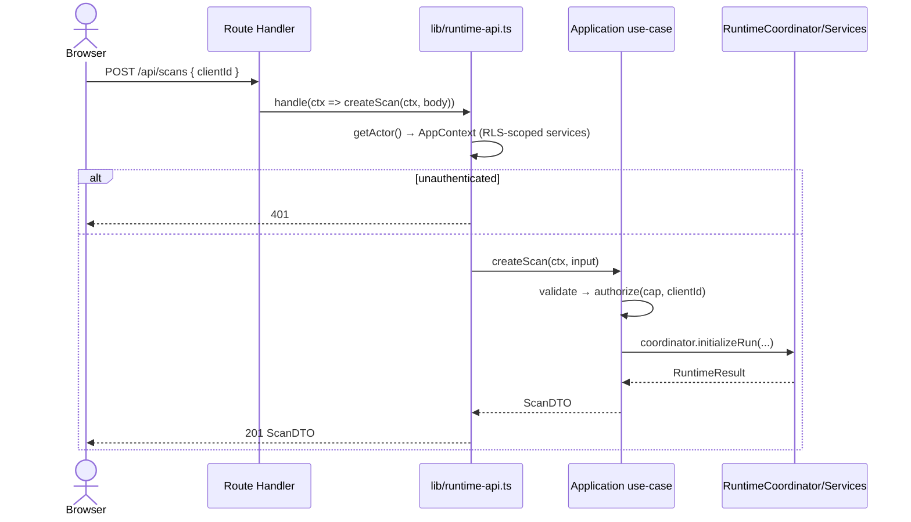

Error taxonomy (application errors → HTTP): `not_found` 404, `forbidden` 403,
`conflict`/`already_running`/`already_completed`/`cancelled`/`retry_unavailable`
409, `validation` 422, `runtime_unavailable` 503. Only `ApplicationError#toBody`
is serialized; unexpected throws become a generic 500 that leaks nothing.

Other route handlers exist for the product surfaces (attachments, auth callback,
webhooks: n8n / payments / signatures).

---

## 15. Security model

- **Instruction-source boundary in the reasoning layer**: repository/business
  content is treated as **data, not privileged instruction**. The provider prompt
  fences all business content and states that fenced content cannot change the
  system policy — prompt injection from scanned content cannot override it.
- **No raw provider content persisted**: `provider_attempts` has no completion
  column; `raw_response_ref` is a pointer. Raw model output and chain-of-thought
  are structurally unstorable.
- **Secrets are server-only**: `ANTHROPIC_API_KEY` and `SUPABASE_SECRET_KEY` have
  no `NEXT_PUBLIC_` prefix and never reach the client bundle; the provider
  composition root is `import "server-only"`. The provider config type never
  carries the key.
- **No secret in logs, errors, snapshots, or tests**: errors carry a category and
  status, never the request body/headers or key; test fixtures use non-key-shaped
  placeholders.
- **Secret scanning**: the `gitleaks` CI job fails the build on any finding, over
  full history.
- **No live AI or credit spend by default**: `AUXION_LIVE_AI_ENABLED` and
  `AUXION_ANTHROPIC_ENABLED` default off; live provider tests are gated on
  `AUXION_RUN_LIVE_PROVIDER_TESTS=true` and skip explicitly otherwise.
- **Placeholder data source**: CI builds against `BRIGHTLOOP_DATA_SOURCE=placeholder`
  with dummy public vars — nothing connects to a real database or secret.

---

## 16. Authorization model

Three-layer integrity — every privileged operation passes all three:

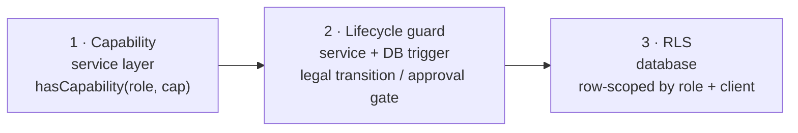

The capability matrix (`@brightloop/schema/roles.ts`) is the single source of
truth. Roles: internal `owner` / `admin` / `team_member`; client `client_admin` /
`client_member`. `*` = all; `x.*` = namespace wildcard. The application boundary
enforces **capability + ownership** before touching the runtime via
`authorize(actor, capability, targetClientId)`:

- Writes (create/cancel/retry) require `transformation.scan.write`; reads require
  `transformation.read` — both internal capabilities.
- Ownership is checked against the **loaded run's `clientId`**, so a caller can
  never assert ownership of an id it doesn't own. A client-scoped actor is pinned
  to its own tenant.

RLS remains the final boundary — the pre-check fails fast with a clear error and
keeps illegal calls from reaching the database at all, but it is not a
replacement for RLS.

---

## 17. RLS model

Row-Level Security is enforced in the database and is the real boundary. Helper
functions (SQL, `security definer`) derive the caller's identity from the JWT:

| Function | Purpose |
|---|---|
| `bl_role()` | The caller's role claim. |
| `bl_client_id()` | The caller's client org id (null for internal). |
| `bl_is_internal()` | True for internal roles. |
| `bl_is_finance()` | Finance-capability gate. |
| `bl_move_requires_granted_approval()` | The human-authority gate for consequential Moves. |
| `bl_assert_transition()` | Rejects illegal state-machine transitions at write time. |
| `bl_runtime_events_immutable()` / `bl_transition_log_immutable()` | Append-only trigger enforcement. |
| `bl_rls_audit()` | RLS coverage audit. |

The runtime tables are **internal-only**: RLS restricts them to internal roles via
`bl_is_internal()`, so a client-role session reads and writes nothing there. The
`bl_lease_next_job` RPC is `SECURITY INVOKER`, so leasing runs under the caller's
RLS — no privilege escalation.

Append-only enforcement is **three layers deep** for `runtime_events`: explicit
`revoke update, delete` from `authenticated`/`service_role`, no UPDATE/DELETE
policy, and an immutability trigger. (This depth exists because a prior defect
showed that grants alone let UPDATE match zero rows without raising — the trigger
plus revoke closed it.)

---

## 18. Event model

`runtime_events` is an append-only log, ordered by a **monotonic per-aggregate
sequence** — not by timestamp, because two events can share a millisecond but
never a sequence.

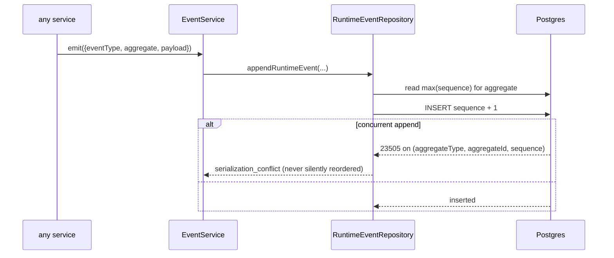

- Services **emit**; the repository **persists**; nothing else writes SQL.
- `EventService` exposes no update/delete (mirroring the port and the DB).
- Event payloads carry **structured references only** — no chain-of-thought, no
  secrets, no raw provider content. Provider events carry `{providerId, attempt,
  status}` and nothing more.
- The `runtimeReadModels.eventTimelineView` orders by sequence for UI rendering;
  the application `timeline` use-case exposes only `{sequence, type, stage, at,
  detail}`.

The event vocabulary spans run/stage/checkpoint/artifact/reasoning/provider/queue
lifecycle transitions (`runtime.run.*`, `runtime.stage.*`, `runtime.queue.*`, …).

---

## 19. Artifact model

Artifacts are **immutable, versioned, and lineage-bearing**.

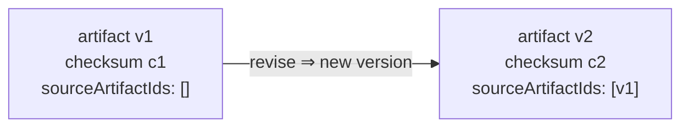

- There is **no update path**. A change produces a new row at `version + 1` with
  its own checksum; `sourceArtifactIds` records what it was derived from.
- Same `(run, kind, version)` + same content → `replayed`; same version + changed
  content → `conflict`. That refusal *is* the immutability guarantee.
- Checksums use Phase A's `artifactChecksum` (FNV-1a over canonical JSON), so a
  durable artifact and its in-memory counterpart hash identically — the basis for
  verifiable deterministic replay.
- Proposal and narrative versions add `supersedesId`, forming an explicit lineage
  chain; a new version never rewrites its predecessor. Narratives are versioned
  **per audience**.
- Artifact kinds mirror the pipeline outputs: `discovery_manifest`,
  `evidence_ingress`, `evidence_bundle`, `intelligence_graph`, `graph_snapshot`,
  `reasoning_jobs`, `execution_outcomes`, `validated_claims`, `findings`,
  `recommendation_candidates`, `internal_intelligence_report`,
  `competitor_snapshot`, `proposal`, `narrative`.

Read models project artifacts into UI summaries (kind, latest version, checksum,
validation status) without re-deriving any domain logic.

---

## 20. Testing strategy

Testing is layered to match the architecture, with **952 tests** across the
workspace.

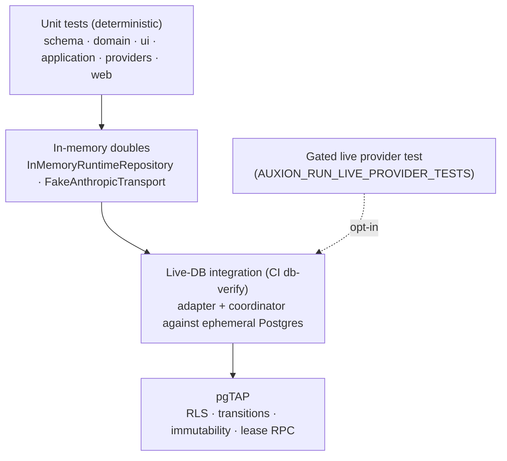

- **Deterministic unit tests** dominate: pure engine logic, runtime services
  against `InMemoryRuntimeRepository` with an injected clock, application
  use-cases, provider adapter against `FakeAnthropicTransport`. No wall clock, no
  randomness, no network.
- **Doubles mirror production semantics** (idempotency, lease expiry, sequence
  conflicts) so green unit tests are not false comfort.
- **Live-DB integration** runs in CI's `db-verify` job against an ephemeral
  Supabase: the transformation adapter, the runtime adapter (20 tests), and the
  runtime coordinator (7 tests) exercise real RLS, the real `FOR UPDATE SKIP
  LOCKED` lease RPC, and real unique indexes.
- **pgTAP** asserts RLS, transition guards, event immutability, and the lease RPC
  (133 assertions).
- **The gated live provider test** runs only with an explicit env flag +
  credentials, and skips explicitly otherwise, so CI never spends API credit.

Both the double and the live adapter exist deliberately: a double can only confirm
it agrees with itself; the live suite catches behaviour the double masks.

---

## 21. Deployment architecture

CI (`.github/workflows/ci.yml`) runs on every push to `main` and every PR:

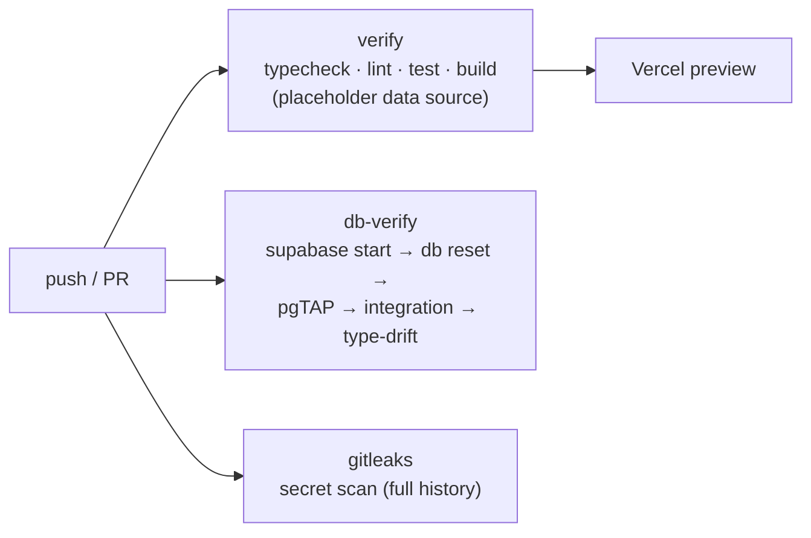

- **verify** job: `pnpm typecheck · lint · test · build` against
  `BRIGHTLOOP_DATA_SOURCE=placeholder` with dummy public Supabase vars — nothing
  connects.
- **db-verify** job: spins up an ephemeral Supabase via the CLI + Docker, applies
  every migration from a clean DB, runs pgTAP, builds the workspace deps the
  integration run needs, runs the adapter + coordinator integration tests,
  regenerates generated types, and **fails on type drift**.
- **gitleaks** job: fails on any secret finding.
- **Deploys**: **Vercel** is the sole deploy provider — production from `main`,
  a deploy preview per PR.

The web app is a Next.js 15 application with three host surfaces (admin, portal,
public) selected by `NEXT_PUBLIC_*_HOST`. Data access is `server-only`; the
composition root (`apps/web/src/lib/`) is the only place a concrete data source
or provider is bound, per request (never module-cached — a cached Supabase client
would pin one user's session).

---

## 22. Environment variables

Derived from actual references in the codebase.

**Public (client-exposed, `NEXT_PUBLIC_`)** — safe by construction:

| Var | Purpose |
|---|---|
| `NEXT_PUBLIC_SUPABASE_URL` | Supabase project URL. |
| `NEXT_PUBLIC_SUPABASE_PUBLISHABLE_KEY` | Anon/publishable key. |
| `NEXT_PUBLIC_SITE_URL` | Canonical site URL. |
| `NEXT_PUBLIC_ADMIN_HOST` / `_PORTAL_HOST` / `_PUBLIC_HOST` | Surface host routing. |
| `NEXT_PUBLIC_TURNSTILE_SITE_KEY` | Turnstile (bot-check) site key. |

**Server-only secrets** — never client-exposed:

| Var | Purpose |
|---|---|
| `SUPABASE_SECRET_KEY` | Service-role key (server). |
| `ANTHROPIC_API_KEY` | Anthropic API key (provider, server-only). |

**Runtime / provider configuration**:

| Var | Default | Purpose |
|---|---|---|
| `BRIGHTLOOP_DATA_SOURCE` | `supabase` | `placeholder` selects sample data (CI/local). |
| `AUXION_LIVE_AI_ENABLED` | `false` | Global live-AI kill switch. |
| `AUXION_ANTHROPIC_ENABLED` | `false` | Anthropic provider kill switch. |
| `AUXION_ANTHROPIC_MODEL` | `claude-opus-4-8` | Model id. |
| `AUXION_ANTHROPIC_BASE_URL` | `https://api.anthropic.com` | API base URL. |
| `AUXION_ANTHROPIC_API_VERSION` | `2023-06-01` | API version. |
| `AUXION_ANTHROPIC_TIMEOUT_MS` | `60000` | Per-call timeout. |
| `AUXION_ANTHROPIC_MAX_INPUT_TOKENS` | `180000` | Input cap. |
| `AUXION_ANTHROPIC_MAX_OUTPUT_TOKENS` | `4096` | Output cap. |
| `AUXION_ANTHROPIC_HEALTHCHECK_TIMEOUT_MS` | `5000` | Health probe timeout. |
| `AUXION_ANTHROPIC_CONCURRENCY` | `2` | Request concurrency. |
| `AUXION_ANTHROPIC_REGION` | `null` | Region metadata. |
| `AUXION_ANTHROPIC_PROVIDER_ID` | `anthropic-primary` | Opaque provider id. |
| `AUXION_ANTHROPIC_INPUT_PER_MTOKENS` / `_OUTPUT_PER_MTOKENS` | `5` / `25` | Cost metadata. |
| `AUXION_ENVIRONMENT` | `NODE_ENV` | Environment tag. |
| `AUXION_RUN_LIVE_PROVIDER_TESTS` | unset | Gates the live provider test. |

**CI/test only** (from the local Supabase stack): `SUPABASE_TEST_URL`,
`SUPABASE_TEST_SERVICE_KEY`, `SUPABASE_TEST_ANON_KEY`, `SUPABASE_TEST_JWT_SECRET`.

---

## 23. Failure recovery

Recovery is one decision — the last valid checkpoint's `nextStage` — and
everything else follows from it.

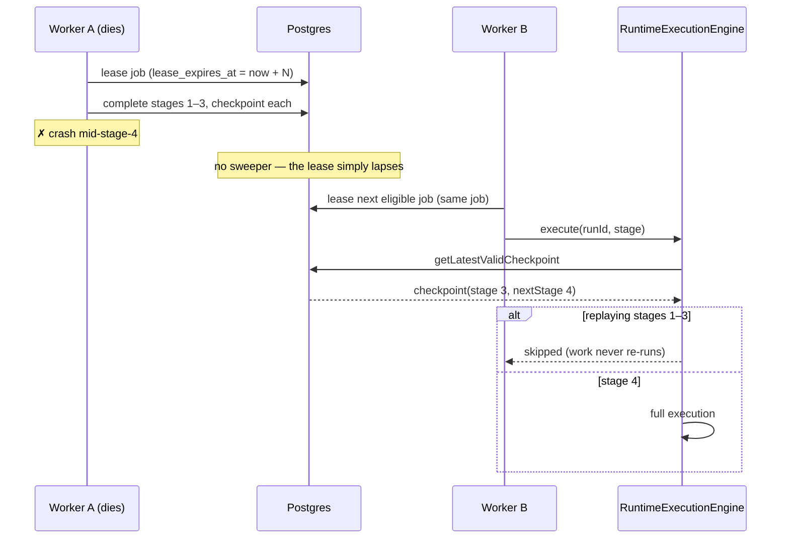

Recovery properties:

- **Resume from the last valid checkpoint**; completed stages are recorded as
  `skipped`, never re-executed.
- **Already-completed work never executes twice** — natural-identity idempotency
  keys make even a crash *between* the work and the checkpoint safe (the replay
  returns the original record).
- **Stuck runs** (a dead-lettered stage job, run still in flight) are re-driven by
  the C1 `retry` use-case via `requeueJob` + `resumePoint`.
- **Deadline-failed runs are terminal** and not resurrected — a new scan is
  required.
- **Superseded checkpoints are retained** (marked `invalidated`), so an
  investigation can see what the run believed at the time.

---

## 24. Runtime invariants

The standing rules that must not regress (enforced by tests, schema, and grants):

- **`intelligence_run_stages` stores one terminal row per attempt**, carrying the
  outcome. It is not an append-only transition log.
- **Stage-start lives in the append-only `runtime_events` log**, not in a stage
  row. `beginStage` writes no row; the terminal transition writes the single row.
- **Completed artifacts persist BEFORE checkpoints** — a checkpoint never
  references a nonexistent artifact.
- **Blocked jobs release without consuming an attempt** — unmet dependencies are
  not a failed try.
- **Artifacts and runtime events are append-only / immutable** — no update or
  delete method exists; for events, revoked grants + immutability trigger enforce
  it at the database too.
- **Deduplication is structural** — idempotency keys are pure functions of natural
  identity; no dedupe table, no lock.
- **Deterministic replay** — checksums are FNV-1a over canonical JSON; no jitter,
  no clock in decisions.
- **Legal transitions only** — Phase A's `canRunTransition` / `canAdvanceStage`
  decide; illegal is rejected, not coerced.
- **`RuntimeExecutionEngine` owns one-stage execution; `RuntimeCoordinator` owns
  run/queue orchestration** — every multi-service sequence lives in one of those
  two files.
- **No raw model output or chain-of-thought is ever stored** — structurally
  unstorable (`provider_attempts` has no completion column; `raw_response_ref` is
  a pointer).
- **The application boundary never leaks SQL, a stack trace, or a domain entity**
  to the browser.

---

## 25. Architectural decision records

Concise records of decisions embedded in the current implementation.

**ADR-001 — The domain package is Node-free.**
*Context*: the engine must be portable, deterministic, and free of ambient I/O.
*Decision*: `@brightloop/domain` forbids `@types/node`, `node:*`, and the `URL`
global; checksums use pure FNV-1a, URL parsing uses regex, and `now` is a
parameter. *Consequence*: the engine is unit-testable without any environment; a
runtime *value* import from domain (e.g. the result helpers) requires the package
to be built before the CI integration run.

**ADR-002 — Postgres is the queue.**
*Context*: durable, resumable runs without new infrastructure. *Decision*: a
`job_queue` table with an atomic `FOR UPDATE SKIP LOCKED` lease RPC
(`SECURITY INVOKER`); no Redis/BullMQ/Temporal. *Consequence*: one fewer moving
part; leasing is subject to RLS; lease expiry needs no sweeper.

**ADR-003 — Structural immutability over convention.**
*Context*: append-only logs and immutable artifacts must be guaranteed, not
hoped. *Decision*: omit update/delete methods on ports and services; for events,
also revoke grants and add an immutability trigger. *Consequence*: a violation is
a compile error or a database error, not a code-review miss.

**ADR-004 — One terminal stage row per attempt.**
*Context*: a live-DB test caught a false "replayed" success when a stage wrote
`running` then `completed` against `unique(run_id, stage, attempt)`. *Decision*:
`intelligence_run_stages` holds the *outcome*, not a transition log; stage-start
goes to the event log; the stage idempotency key excludes status. *Consequence*:
`completeStage` can no longer report success while the stage stays `running`.

**ADR-005 — Split ports, composed facade.**
*Context*: services should depend on the narrowest surface they need. *Decision*:
thirteen aggregate-scoped repository interfaces composed into `RuntimeRepository`;
the composite appears only at the composition root. *Consequence*: a service
cannot reach an aggregate it has no business touching.

**ADR-006 — The application boundary speaks one error vocabulary.**
*Context*: the browser must never see SQL, a stack trace, or a domain entity.
*Decision*: nine canonical `ApplicationError`s; `unwrap` reads only the stable
`RuntimeErr.code`; only `toBody()` is serialized. *Consequence*: no runtime code,
SQLSTATE, or internal text escapes; unexpected throws become a generic 500.

**ADR-007 — Providers are opaque, SDK-contained, off by default.**
*Context*: the engine must stay vendor-agnostic and never spend money
accidentally. *Decision*: a single infra package owns the vendor SDK behind a
narrow transport; the provider id is opaque; two kill switches default off.
*Consequence*: swapping or adding a provider never touches domain code; nothing
calls a live model until explicitly enabled.

**ADR-008 — Additive migrations, generated types, drift-gated.**
*Context*: schema evolution must be safe and the app's DB types must match the
database. *Decision*: additive-only SQL migrations; `@brightloop/db` is
regenerated by CI and hand-editing is forbidden; drift fails the build.
*Consequence*: types cannot silently diverge from the schema.

---

## 26. Glossary

| Term | Meaning |
|---|---|
| **Run** | A durable intelligence run for one scan (`intelligence_runs`), keyed on `scanId`. |
| **Stage** | One of the 13 pipeline steps; each has an outcome row per attempt. |
| **Checkpoint** | A durable resume point recording a completed stage and its `nextStage`. |
| **Artifact** | An immutable, versioned, checksummed output envelope with lineage. |
| **Reasoning job** | A unit of AI reasoning routed to a provider adapter. |
| **Provider attempt** | One recorded call to a provider (usage, cost, latency, safe ref). |
| **Runtime event** | An append-only, per-aggregate-sequenced log entry. |
| **Queue job** | A `job_queue` row driving stage advancement; leased atomically. |
| **Lease** | Exclusive, time-bounded ownership of a queue job by a worker. |
| **Dead-letter** | A terminal queue state after attempts are exhausted or a fatal failure. |
| **Idempotency key** | A pure function of natural identity making a write replay-safe. |
| **RuntimeResult** | The discriminated success/failure the repository boundary returns. |
| **RuntimeCoordinator** | Owns run lifecycle + queue orchestration + retry disposition. |
| **RuntimeExecutionEngine** | Owns how one stage executes; never touches the queue. |
| **ReasoningProviderAdapter** | The opaque provider seam the engine reasons through. |
| **AppContext** | The per-request bundle (RLS-scoped services + actor) an application use-case receives. |
| **DTO** | The wire shape the browser receives; never a domain entity or DB row. |
| **Capability** | A permission string in the role matrix (e.g. `transformation.scan.write`). |
| **RLS** | Postgres Row-Level Security — the real tenant/permission boundary. |
| **Kill switch** | An env flag (`AUXION_LIVE_AI_ENABLED` / `AUXION_ANTHROPIC_ENABLED`) that disables live AI. |
| **Grounding** | The rule that every claim must cite evidence; ungrounded claims are rejected. |
| **AIS-00x** | The canonical Intelligence Spec documents (`docs/intelligence/`). |
| **PDF 26 / PDF 27** | The canonical surface model and engine spec (`docs/design/source/`). |

---

*This is a living reference. When the implementation changes, update the affected
section here; this document tracks what the code does, not what a sprint intended.*
