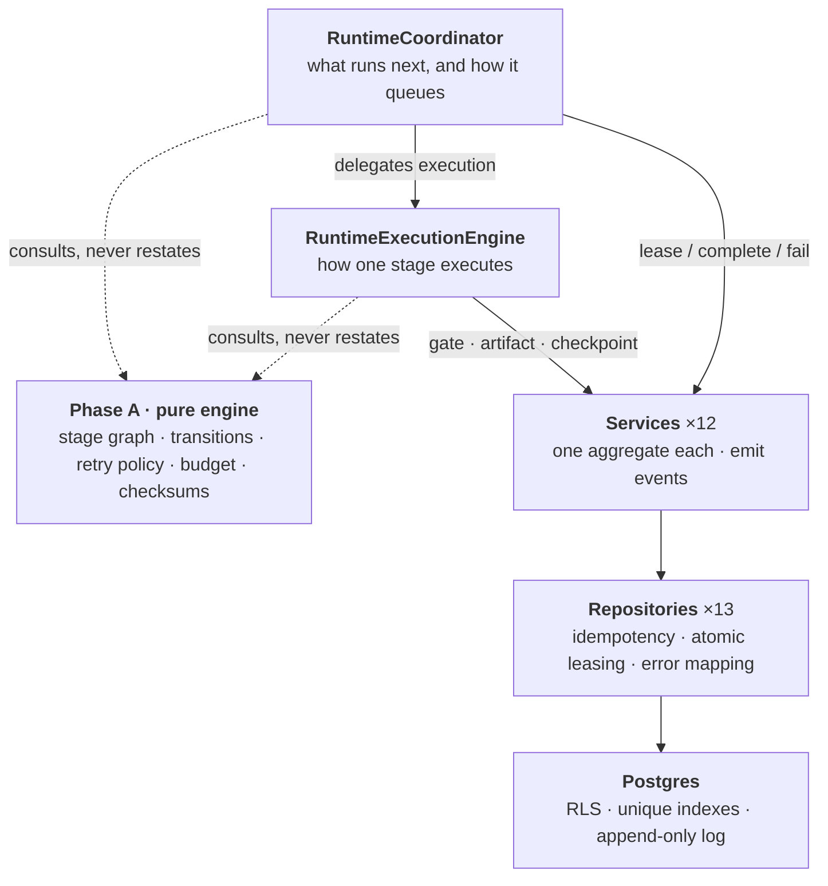
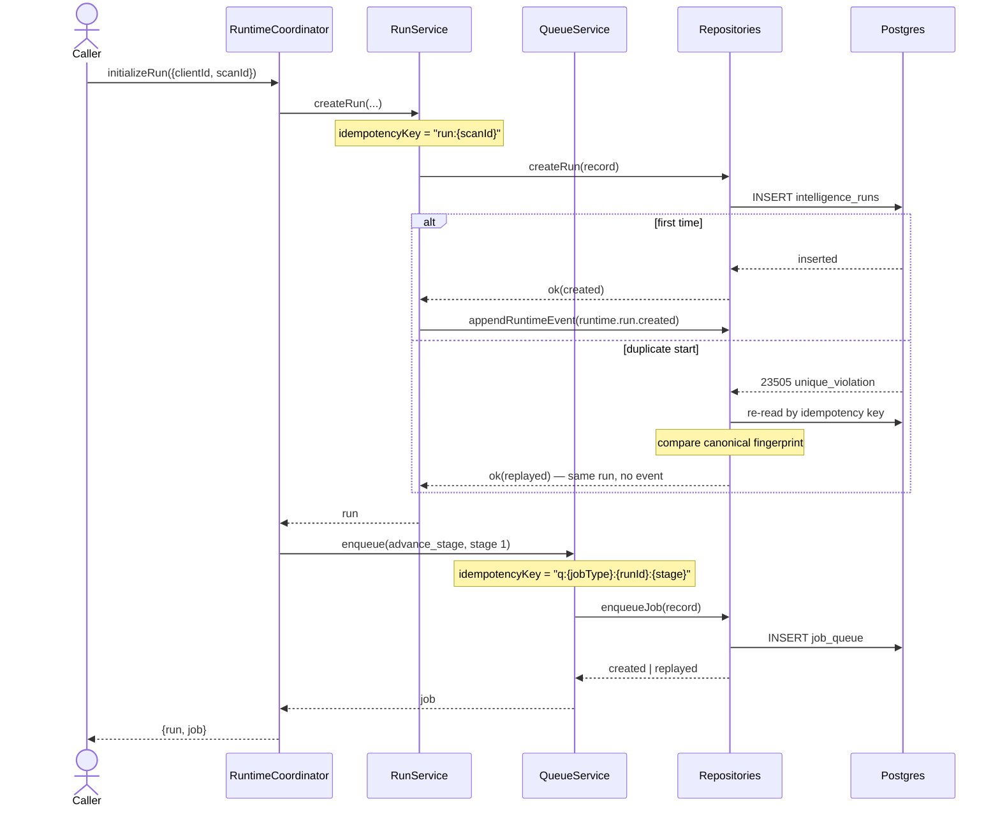
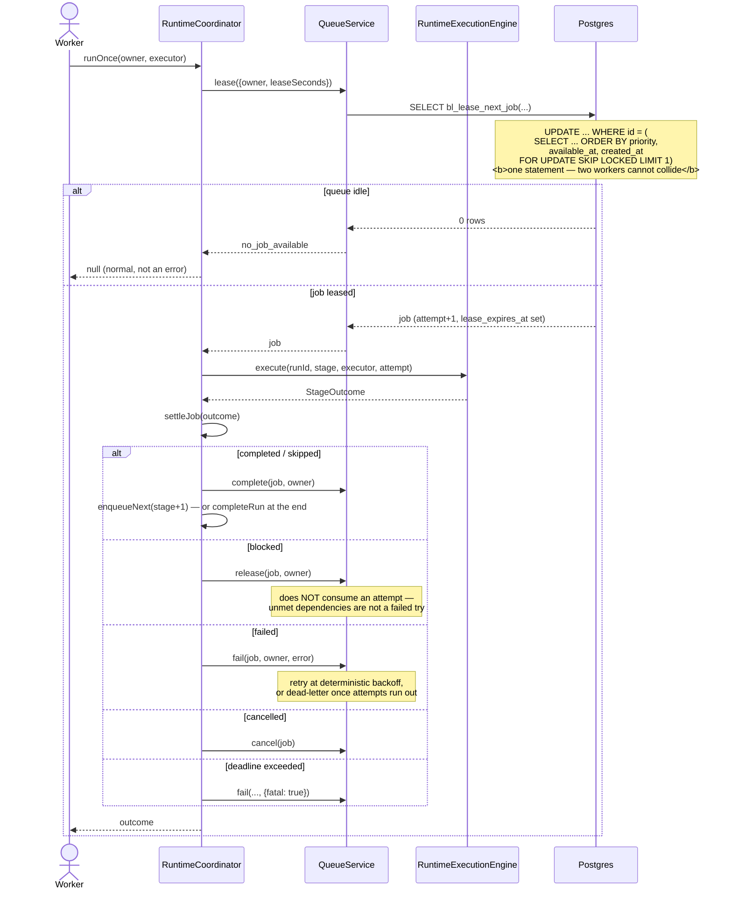
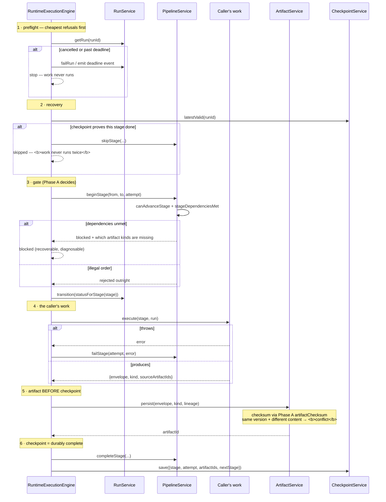
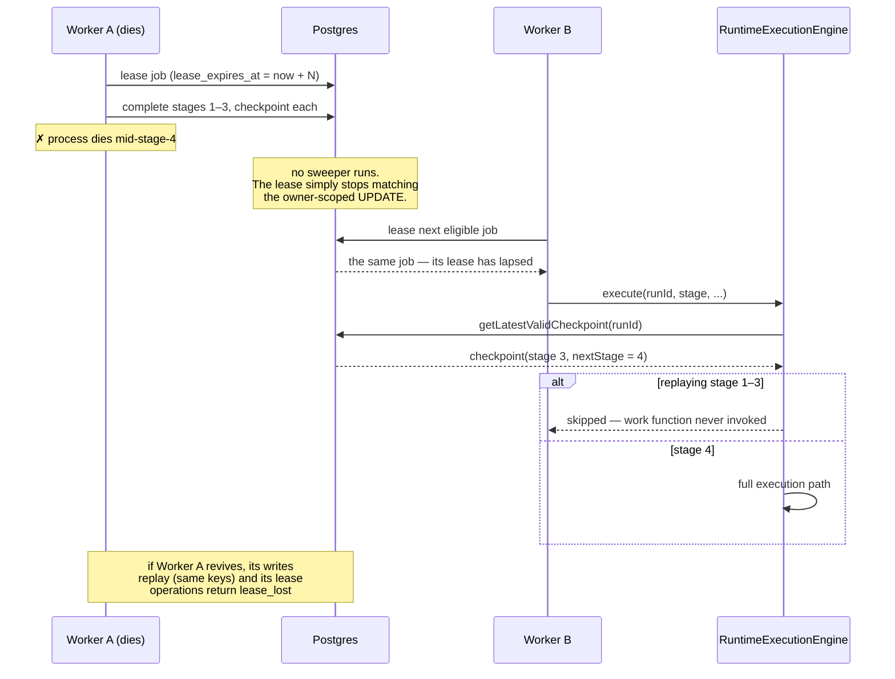
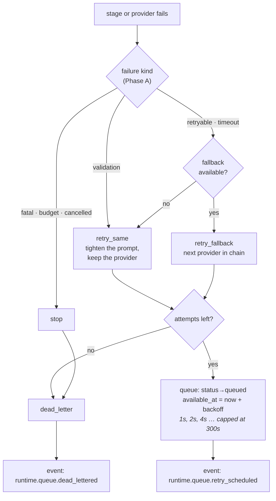
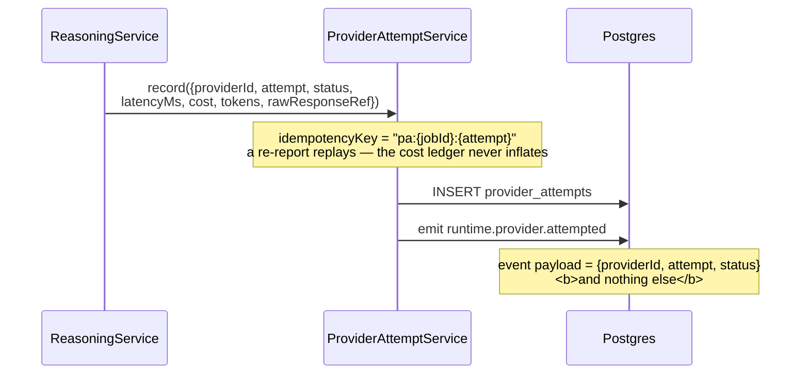
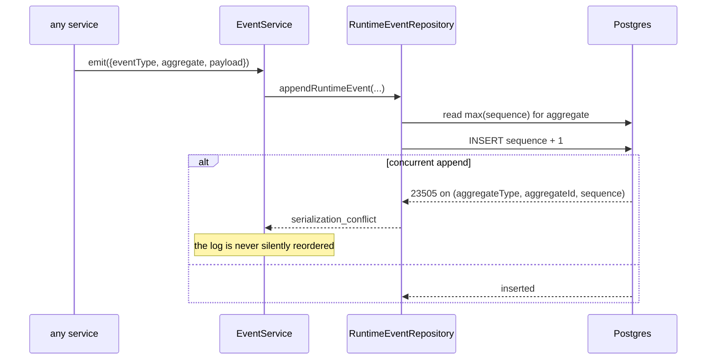
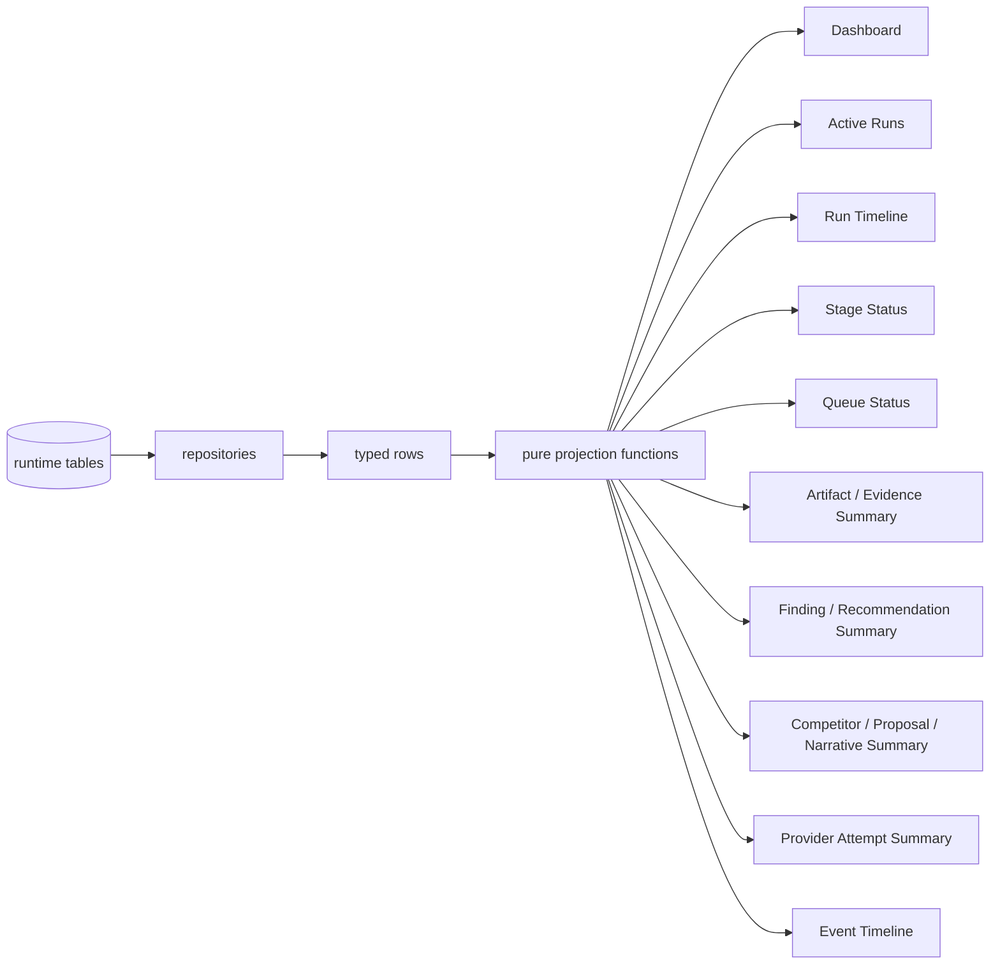

# Runtime Sequences — Phase B

How the AUXION runtime actually executes, as sequence diagrams.

Scope: Sprint 13A (persistence schema, RLS), 13B (repository ports, typed adapters, atomic leasing) and 13C (services, execution engine, coordinator, read models).

**Nothing here schedules itself.** There is no daemon, no cron, no hosted queue. Postgres is the queue; a caller decides when a worker turn happens.

---

## 1 · Layers

Each layer answers one question and defers the rest.

Two rules hold this together:

1. **Phase A decides, Phase B persists.** Stage dependencies, legal transitions, retry disposition and checksums are Phase A's. The runtime consults them; it never restates them. Re-deriving any rule would fork the truth.
2. **The engine never touches the queue.** Stage execution is testable and reusable without a queue in the picture — a backfill or manual re-run drives the engine directly.

---

## 2 · Starting a run

Both writes are keyed on natural identity, so calling this twice converges on the same two rows rather than forking a second run.

Same key + **different** payload returns `conflict`, never a silent overwrite. That refusal is what makes replay safe.

---

## 3 · One worker turn

The unit a queue consumer repeats. It performs exactly one turn and returns.

---

## 4 · Executing one stage

Six ordered steps. A crash between any two is safe: every write is keyed on natural identity, so the replay returns the original record instead of creating a second one.

Step 5 precedes step 6 deliberately: **a checkpoint must never reference an artifact that does not exist.**

---

## 5 · Crash recovery

Recovery is one decision — the last valid checkpoint's `nextStage` — and everything else follows from it.

Superseding a checkpoint marks it `invalidated` with a reason and **retains the row**. History is never destroyed, so a later investigation can see what the run believed at the time.

---

## 6 · Retry, fallback and dead-letter

The disposition is Phase A's `decideRetry`; the runtime only makes it durable.

Backoff is deterministic — **no jitter** — so a replay of the same failure sequence reproduces the same schedule.

---

## 7 · Provider attempts — what is and isn't stored

`provider_attempts` has **no column for completion text**. Raw model output and chain-of-thought are structurally unstorable, not merely discouraged — `rawResponseRef` is a pointer to storage held elsewhere. `providerId` is opaque; no domain code branches on a vendor name.

---

## 8 · Append-only event log

Immutability is enforced three times over, deliberately:

| Layer | Mechanism |
|---|---|
| Service | `EventService` exposes no update or delete |
| Port | `RuntimeEventRepository` declares no update or delete |
| Database | UPDATE/DELETE revoked · no policy · immutability trigger |

The database layer exists because grants alone were not enough: a 13A defect found in CI showed UPDATE matching *zero rows* (so the trigger never fired) rather than raising. Explicit `revoke` plus the trigger closed it.

---

## 9 · Read models

Projections only — rows in, view out. **No scoring, ranking, confidence maths or severity logic**: all of that was decided in Phase A and is already baked into the envelopes being read back. A read model that re-derived any of it would create a second, silently divergent source of truth.

The Event Timeline sorts by **sequence, not timestamp** — two events can share a millisecond, never a sequence.

---

## 10 · Guarantees and where they live

| Guarantee | Enforced by |
|---|---|
| No duplicate execution | Idempotency keys derived from natural identity + checkpoint skip |
| Idempotent retries | Replay-vs-conflict on every write path |
| Deterministic replay | Phase A `artifactChecksum` (FNV-1a over canonical JSON); no jitter, no clock in decisions |
| Checkpoint recovery | Last valid checkpoint's `nextStage`; invalidated rows retained |
| Append-only artifacts | No update method on port or service; conflict on changed content at same version |
| Append-only events | Service + port + revoked grants + trigger |
| Immutable versions | `supersedesId` chain; a new version never rewrites its predecessor |
| Legal transitions only | Phase A `canRunTransition` / `canAdvanceStage`; illegal is rejected, not coerced |
| Preserved lineage | `sourceArtifactIds` and `supersedesId` on the rows themselves |
| One worker per job | `FOR UPDATE SKIP LOCKED` in a single statement |
| Lease ownership | Owner re-asserted *inside* every mutating statement |
| Tenant isolation | RLS on internal-only tables; adapters never use the service role |

---

## Related

- `packages/schema/src/runtime.ts` — runtime contracts
- `packages/domain/src/runtime/repository.ts` — the 13 ports
- `packages/domain/src/runtime/services/` — services, execution engine, coordinator, read models
- `packages/data/src/runtime/adapter.ts` — typed Supabase adapter
- `supabase/migrations/20260720000100_runtime_persistence.sql` — tables, RLS, immutability trigger
- `supabase/migrations/20260721000100_runtime_lease_rpc.sql` — `bl_lease_next_job`
